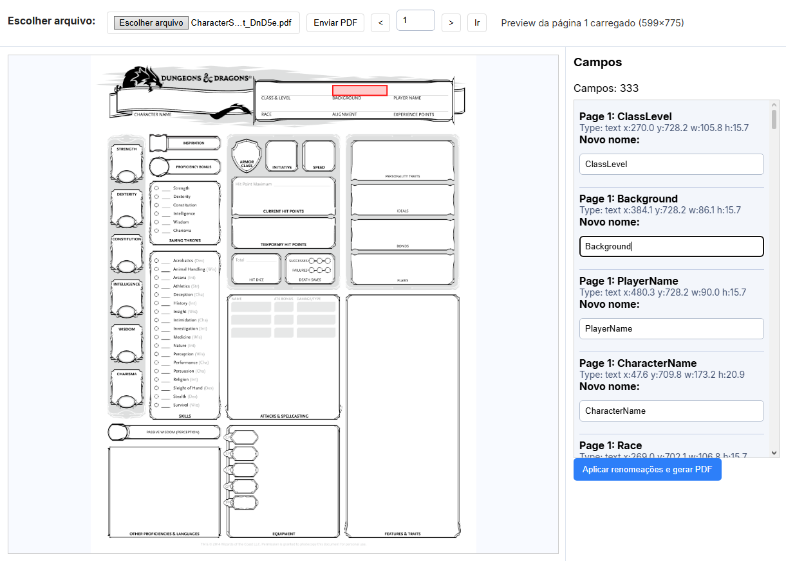

# PDF Field Labeler


Ferramenta profissional para **identificação, mapeamento e normalização de campos AcroForm em PDFs**. Processe formulários em lote, renomeie campos e gere PDFs padronizados com uma interface web intuitiva ou via CLI.

## 🎯 Quick Start

```bash
# 1. Clone e instale
git clone https://github.com/andre12burger/PDF-Field-Labeler.git
cd PDF-Field-Labeler
conda env create -f environment.yml

# 2. Ative o ambiente
conda activate pdf-form-labeler

# 3. Inicie o servidor
./start_server.ps1  # ou: uvicorn web.app:app --port 8000

# 4. Abra no navegador
# http://localhost:8000
```

## 🖼️ Screenshot



**Exemplo em ação:** Processando formulário D&D 5e com 333 campos • Upload • Visualize campos • Renomeie • Baixe normalizado

## ✨ Funcionalidades

- 🔍 **Extração automática** de campos PDF (texto, checkbox, signature, choice)
- 📝 **Rename em lote** com interface visual ou CLI
- 📊 **Processamento automatizado** via JSON mapping
- 🎨 **Web UI responsiva** para gerenciamento visual
- ⚡ **API REST** para integração em pipelines
- 💾 **Exportar PDFs** com campos normalizados

## 📋 Uso

### Via Interface Web

**Recomendado para uso geral:**

```bash
uvicorn web.app:app --port 8000
# Acesse: http://localhost:8000
```

Fluxo: Upload → Visualize campos → Edite nomes → Baixe PDF

### Via Linha de Comando

**Para automação e processamento em lote:**

```bash
# Extrair metadata
python scripts/extract_pdf_field_metadata.py input.pdf metadata.json

# Aplicar normalização
python scripts/normalize_pdf_fields.py input.pdf output.pdf \
  --map field_map.json --fill --verify
```

## 📦 Requisitos

- **Python 3.8+**
- **Dependências:** pypdf, fastapi, uvicorn, pdf2image, Pillow

Veja [docs/INSTALLATION.md](docs/INSTALLATION.md) para instalação detalhada.

## 📚 Documentação

- [**Guia de Instalação**](docs/INSTALLATION.md) - Setup com Conda, venv ou Poetry
- [**Guia de Uso**](docs/USAGE.md) - Web UI, CLI, exemplos práticos
- [**API REST**](docs/API.md) - Endpoints, exemplos de integração
- [**Troubleshooting**](docs/TROUBLESHOOTING.md) - Problemas comuns e soluções

## 🏗️ Estrutura do Projeto

```
├── web/                    # Aplicação web (FastAPI)
│   └── static/            # Frontend (HTML, JS, CSS)
├── scripts/               # Ferramentas CLI
│   ├── extract_pdf_field_metadata.py
│   ├── normalize_pdf_fields.py
│   └── number_text_fields.py
├── data/
│   ├── sample/           # Exemplos
│   ├── uploads/          # PDFs temporários
│   └── out/              # Saída
├── docs/
│   ├── INSTALLATION.md
│   ├── USAGE.md
│   ├── API.md
│   ├── TROUBLESHOOTING.md
│   └── assets/
└── requirements.txt
```

## 📄 Licença

MIT License - veja [LICENSE](LICENSE) para detalhes.

---

**v0.1.0** • Abril 2026 • [Guia Completo](docs/USAGE.md)
